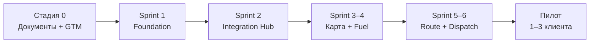

# FleetPilot — Следующая стадия: пошаговый план

**Дата:** 22 июня 2026  
**Текущая стадия:** 0 — Product Foundation (завершена)  
**Следующая стадия:** 1 — Sprint 1 Foundation (недели 1–2)  
**Linear:** проект FleetPilot · issues SLI-5 … SLI-72

---

## 1. Анализ: где вы сейчас

### ✅ Стадия 0 — сделано

| Блок | Статус | Артефакты |
|------|--------|-----------|
| Продукт | ✅ | PRD, архитектура, анализ рынка, pitch-deck |
| UX | ✅ | Wireframes 10 экранов, ROI-калькулятор |
| GTM | ✅ | Лендинг fleetpilot.ru, форма ROI, privacy/terms |
| Backlog | ✅ | 12 недель · 68 задач в Linear |
| Агенты (шаблоны) | 🟡 | config.yaml, prompts, shared Python (без runtime) |
| CI/CD | 🟡 | GitHub Actions + Vercel (нужны secrets) |
| Внедрение | ✅ | IMPLEMENTATION_GUIDE.md для клиентов |

### ❌ Ещё не сделано (критично для MVP)

| Блок | Gap |
|------|-----|
| **Приложение** | Нет Next.js + FastAPI — только прототип HTML |
| **БД** | Нет PostgreSQL / схемы |
| **Auth** | Нет регистрации / входа |
| **Integration Hub** | Нет реального Omnicomm API |
| **Агенты** | Нет Agent Orchestrator, нет запуска агентов |
| **GTM live** | Нужно проверить DNS, форму, Метрику на fleetpilot.ru |
| **Пилот-клиент** | 0 design partners |

### Вывод

Вы завершили **стадию «упаковка продукта»** (документы + лендинг + backlog).  
Следующий логический шаг — **стадия «рабочий MVP»**, начиная со **Sprint 1: Foundation** (FP-1 … FP-8 в Linear).



---

## 2. Три параллельных трека (следующие 4 недели)

| Трек | Владелец | Цель |
|------|----------|------|
| **A. Engineering** | Dev | Monorepo, auth, dashboard shell |
| **B. GTM** | Founder | 10 discovery-интервью, 2 LOI |
| **C. Ops** | Founder/IT | Домен, форма, Linear Sprint 1 |

---

## 3. Трек A — Engineering (Sprint 1)

**Цель Sprint 1:** пользователь регистрируется → создаёт организацию → видит пустой ROI dashboard.

**Linear:** EP-1 Platform & Auth · SLI-5 … SLI-13 (FP-1 … FP-8)

### Неделя 1

| День | Задача | Linear ID | Результат |
|------|--------|-----------|-----------|
| Пн | Monorepo: `apps/web`, `apps/api`, `docker-compose.yml` | FP-1 | `docker compose up` работает |
| Вт | PostgreSQL schema: Organization, User, Vehicle, Integration | FP-2 | Alembic миграция v1 |
| Ср | FastAPI: health, CORS, OpenAPI | FP-1 | `GET /health` → 200 |
| Чт | Auth: signup/login, JWT | FP-3 | Регистрация через API |
| Пт | RBAC middleware | FP-4 | Роли Admin, Dispatcher, … |

### Неделя 2

| День | Задача | Linear ID | Результат |
|------|--------|-----------|-----------|
| Пн | Next.js app shell: sidebar, layout | FP-5 | Dashboard как в wireframes |
| Вт | Страница логина / регистрации | FP-3 | UI auth flow |
| Ср | KPI cards (placeholder данные) | FP-5 | ₽0 экономия, 0 ТС |
| Чт | GitHub Actions: lint + docker build | FP-6 | CI зелёный на PR |
| Пт | Seed script: demo org + 32 ТС | FP-7 | `python scripts/seed.py` |

### Структура monorepo (целевая)

```
fleetpilot/
├── apps/
│   ├── web/          # Next.js 15
│   └── api/          # FastAPI
├── agents/           # уже есть — подключить позже
├── docker-compose.yml
├── packages/         # shared types (опционально)
└── scripts/
    ├── linear_import.py
    └── seed.py
```

### Exit criteria Sprint 1

- [ ] `docker compose up` — web + api + postgres + redis
- [ ] Регистрация и логин работают
- [ ] Dashboard открывается после входа
- [ ] 5 KPI-карточек с placeholder (как wireframe 01)
- [ ] CI проходит на push в `main`

---

## 4. Трек B — GTM (параллельно с разработкой)

**Цель:** 10 интервью → 2 LOI → 1 design partner к концу Sprint 2.

### Неделя 1

| Шаг | Действие |
|-----|----------|
| 1 | Проверить https://fleetpilot.ru — форма, SSL, ссылки |
| 2 | Подключить Formspree / FormSubmit на `hello@fleetpilot.ru` |
| 3 | Яндекс.Метрика на лендинге |
| 4 | Составить список 30 компаний ICP (20–50 ТС, Omnicomm) |
| 5 | Провести 3 discovery-интервью (диспетчер + комдиректор) |

### Неделя 2

| Шаг | Действие |
|-----|----------|
| 6 | Ещё 4 интервью |
| 7 | Отправить **бесплатный расчёт ROI** первым 5 лидам с лендинга |
| 8 | Предложить **Founding offer** (₽49K × 6 мес) 3 компаниям |
| 9 | Получить 1–2 verbal commit / LOI |
| 10 | Зафиксировать боли в таблице (топливо / диспетчеризация / ТО) |

### Вопросы для discovery (15 мин)

1. Сколько ТС? Какой GPS? (Omnicomm / СтавТРЭК)
2. Сколько % бюджета — топливо? Были ли сливы?
3. Сколько времени на одну заявку? (baseline 2.8 ч)
4. Готовы подключить API ключ для пилота за 2 недели?
5. Кто ЛПР? Бюджет на IT до ₽500K/год?

---

## 5. Трек C — Ops и Linear

### Шаг 1 — Закоммитить текущие изменения

```powershell
cd "C:\Users\Wu\develop\startapp log"
git add .
git status
git commit -m "Add agents, CI/CD, domain fleetpilot.ru, Linear import script"
git push -u origin main
```

### Шаг 2 — Linear Sprint 1

1. Linear → FleetPilot → **Cycles** или **Projects**
2. Создать цикл **Sprint 1 — Foundation** (2 недели)
3. Перетащить issues **FP-1 … FP-8** (SLI-6 … SLI-13 + epic SLI-5)
4. Статус epic SLI-5 → **In Progress**

### Шаг 3 — Vercel secrets (если CI/CD)

GitHub → Settings → Secrets:

| Secret | Где взять |
|--------|-----------|
| `VERCEL_TOKEN` | vercel.com → Account → Tokens |
| `VERCEL_ORG_ID` | `.vercel/project.json` |
| `VERCEL_PROJECT_ID` | `.vercel/project.json` |

### Шаг 4 — Домен

См. [`landing/DOMAIN.md`](../landing/DOMAIN.md) — если ещё не Valid Configuration в Vercel.

---

## 6. Roadmap по спринтам (12 недель)

| Sprint | Недели | Фокус | Demo |
|--------|--------|-------|------|
| **S1** ← **ВЫ ЗДЕСЬ** | 1–2 | Auth + dashboard | Вход → пустой dashboard |
| S2 | 3–4 | Omnicomm + Integration Hub | 28 ТС на карте |
| S3 | 5–6 | Fleet map + alerts | Live GPS + отклонение |
| S4 | 7–8 | Fuel Agent | Алерт слива |
| S5 | 9–10 | Route Agent | Оптимизация маршрута |
| S6 | 11–12 | Dispatch + Billing | End-to-end + оплата |

---

## 7. Приоритеты «что делать первым» (эта неделя)

### День 1 (сегодня)

1. ✅ Прочитать этот документ
2. Linear → старт Sprint 1, взять **FP-1** в In Progress
3. Проверить fleetpilot.ru в браузере
4. `git commit` + `git push` всех незакоммиченных файлов

### День 2–3

5. Создать monorepo (`apps/api`, `apps/web`, `docker-compose.yml`)
6. 3 discovery-интервью (звонки)
7. Настроить форму на лендинге

### День 4–5

8. PostgreSQL schema + auth API
9. Ещё 2 интервью
10. Next.js login page (минимальный UI)

---

## 8. Риски следующей стадии

| Риск | Митигация |
|------|-----------|
| Нет dev-ресурса | Начать с FP-1–3 solo; аутсорс UI на неделе 2 |
| Нет пилот-клиента | GTM-трек обязателен параллельно с кодом |
| Omnicomm API закрыт | Пилот только со СтавТРЭК или CSV import |
| Scope creep | Только FP-1…FP-8 в Sprint 1, агенты — с Sprint 2+ |

---

## 9. Связанные документы

| Документ | Когда читать |
|----------|--------------|
| [`backlog-12-weeks.md`](fleet-ai/backlog-12-weeks.md) | Детали каждого спринта |
| [`architecture.md`](fleet-ai/architecture.md) | Стек и API |
| [`PRD.md`](fleet-ai/PRD.md) | Требования MVP |
| [`IMPLEMENTATION_GUIDE.md`](IMPLEMENTATION_GUIDE.md) | Для клиента при пилоте |
| [`agents/README.md`](../agents/README.md) | Шаблоны агентов (Sprint 2+) |

---

## 10. Definition of Done — Стадия 1

Стадия 1 считается завершённой, когда:

- [ ] Работает `https://app.fleetpilot.ru` или staging URL с auth
- [ ] 1 design partner подписал LOI
- [ ] Omnicomm adapter в разработке (Sprint 2 стартовал)
- [ ] ≥ 10 discovery-интервью проведено
- [ ] Founding offer отправлен ≥ 5 компаниям

---

*FleetPilot · Next Stage Plan · v1.0*
