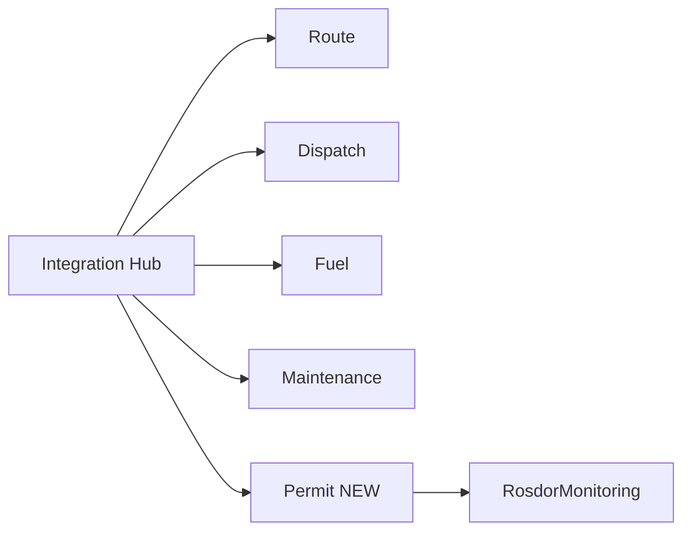

# FleetPilot — Deep Analysis Threads

**Версия:** 1.0 · **Дата:** 23.06.2026  
**Назначение:** нити глубокого анализа для продукта, интеграций и GTM (на основе discovery .docx)

---

## Thread 1 — Рынок и ICP

| Вопрос | Гипотеза | Как проверить |
|--------|----------|---------------|
| Кто платит быстрее? | FTL 20–50 ТС с Omnicomm | 10 discovery-интервью |
| Негабарит — отдельный ICP? | Да, выше ARPU, боль Permit | 5 интервью со спецперевозчиками |
| Конкуренция TMS? | Не заменяем, слой поверх | Позиционирование на лендинге |

---

## Thread 2 — Росдормониторинг / Permit Agent

| Вопрос | Вывод | Действие |
|--------|-------|----------|
| Официальный API? | Нет | parser-api + Playwright LK |
| Юридическая ответственность? | На перевозчике | HITL обязателен |
| 152-ФЗ? | Контуры A/B/C | Gateway + audit |
| LLM для ПОДД? | GigaChat + RAG | legal_docs corpus |

---

## Thread 3 — AI / LLM

| Слой | Модель | Use case |
|------|--------|----------|
| Bulk | DeepSeek / YandexGPT | JSON маршрута, классификация |
| Legal | GigaChat Pro + RAG | ПОДД, 257-ФЗ, компенсация |
| Complex | Claude Sonnet | Отчёты ЛПР, multi-step |
| On-prem | Saiga-Llama3 | Строгий 152-ФЗ |

**Каскад:** 90% запросов → дешёвая модель; edge cases → premium.

---

## Thread 4 — Продукт (5 агентов)

**Gap до этого анализа:** Permit Agent и Росдормониторинг не были в PRD v1.0.

---

## Thread 5 — GTM / Sales

| Этап | Артефакт | Owner |
|------|----------|-------|
| Inbound | fleetpilot.ru + ROI form | Marketing |
| First call | BANT script | Sales |
| Discovery | FIRST-MEETING-GUIDE | Sales + SE |
| Pilot | Founding offer ₽49K | CS + Eng |
| Expand | Permit module upsell | Account |

**Оптимальная схема:** Диагностика → Пилот → Масштабирование.

---

## Thread 6 — Экономика негабарита

| Метрика | Benchmark | KPI FleetPilot |
|---------|-----------|----------------|
| Время на спецразрешение | 4–8 ч вручную | −50% с Permit Agent |
| Штраф ст. 12.21.1 КоАП | до ₽500K+ | Алерты compliance |
| Стоимость ПОДД | ₽50–200K | Черновик AI + юрист |

Добавить в ROI dashboard: `breakdown.permit` (savings category).

---

## Thread 7 — Технический долг / риски

1. DNS fleetpilot.ru → использовать `76.76.21.21` (не `216.198.79.1` из РФ)
2. Нет официального Rosdor API — vendor lock parser-api
3. Playwright хрупкий — нужны E2E smoke tests
4. RAG corpus требует юридического review

---

## Thread 8 — Roadmap приоритеты (после анализа)

| Приоритет | Эпик | Недели |
|-----------|------|--------|
| P0 | Integration Hub (Omnicomm) | 2–4 |
| P0 | 4 базовых агента | 4–8 |
| **P1** | **Permit Agent + Rosdor фаза 1** | **7–9** |
| P1 | Sales playbook + first meeting | now |
| P2 | Playwright LK Rosdor | 9–11 |

---

*FleetPilot · Deep Analysis Threads · v1.0*
