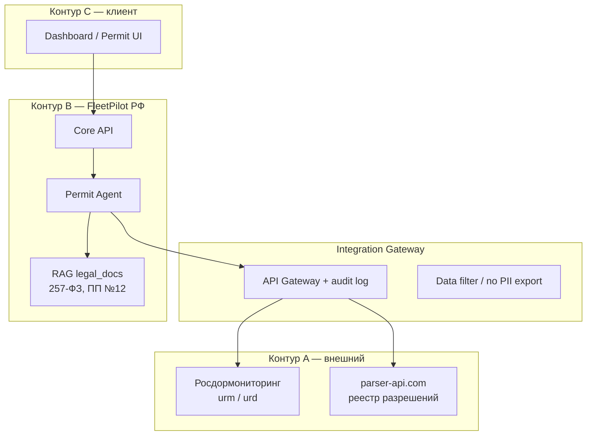

# Интеграция FleetPilot с Росдормониторингом

**Версия:** 1.0 · **Дата:** 23.06.2026  
**Модуль:** Permit Agent · Integration Hub  
**Статус:** Discovery → Sprint 7+ (после Integration Hub MVP)

---

## 1. Задача

Автоматизировать **анализ маршрутов** и подготовку данных для **оформления спецразрешений** на перевозку негабаритных и тяжеловесных грузов через экосистему **Росдормониторинг** (ФГУП «Росдормониторинг»).

**Ценность для клиента:**

- Сокращение времени подготовки заявки (часы → минуты на черновик)
- Меньше отказов из‑за неверного маршрута / габаритов
- Единый контур: GPS + TMS + разрешения в FleetPilot
- AI-объяснение: ПОДД, компенсация, особые условия

---

## 2. Системы Росдормониторинг

| URL | Назначение |
|-----|------------|
| [urd.safe-route.ru](https://urd.safe-route.ru) | Публичный реестр / проверка разрешений |
| [urm.safe-route.ru](https://urm.safe-route.ru) | Личный кабинет перевозчика (маршрут А→Б, заявка) |

> **Нет официального открытого REST API** у Росдормониторинга. Интеграция — гибридная (см. §4).

---

## 3. Архитектура (3 контура — 152-ФЗ)



**Правила изоляции:**

- ПДн и коммерческие данные **не уходят** во внешний контур без маскирования
- Логи всех запросов к Росдормониторингу — audit trail
- Credentials ЛК — encrypted at rest (как Integration Hub)

---

## 4. Три подхода интеграции (roadmap)

### Фаза 1 — Реестр и проверка (MVP Permit Agent)

**Инструмент:** сторонний API реестра (например parser-api.com / аналог)  
**Возможности:**

- Проверка разрешения по номеру + госномер
- История маршрутов и параметров ТС
- Особые условия движения

```python
# apps/api — будущий адаптер
GET /api/v1/integrations/rosdor/permits/check
POST /api/v1/agents/permit/analyze-route
```

**Env:** `ROSDOR_PARSER_API_KEY`, `ROSDOR_PARSER_BASE_URL`

### Фаза 2 — Построение маршрута (автоматизация ЛК)

**Инструмент:** Playwright / Selenium (headless, по согласованию клиента)  
**Сценарий:**

1. Вход в urm.safe-route.ru (credentials org)
2. Точки А → Б, промежуточные точки
3. Параметры ТС: длина, ширина, высота, масса, нагрузка на оси
4. Получение маршрута + флагов ПОДД + ограничений
5. LLM-анализ результата (structured JSON)

**Human-in-the-loop:** диспетчер подтверждает перед подачей заявки.

### Фаза 3 — Оптимизация и документы

- OSRM / Yandex Maps + база ограничений дорог
- AI-генерация черновика ПОДД (GigaChat / Claude + RAG по 257-ФЗ, ПП №12)
- Расчёт компенсации владельцу дороги (шаблон + правила)

---

## 5. Permit Agent — pipeline

```
Input: заявка (А, Б, габариты, масса, оси, ТС, груз)
  → Normalize vehicle + cargo model
  → Route build (Фаза 1: ручной / Фаза 2: RDM LK / Фаза 3: OSRM+restrictions)
  → Check limits (2.55×4×12 м без разрешения)
  → LLM: нужен ли ПОДД? особые условия?
  → Output: draft permit package + risk score + альтернативные маршруты
  → Human approval → submit (вне FleetPilot или Фаза 2 auto-fill)
```

---

## 6. LLM-стратегия (каскад)

| Задача | Модель | Почему |
|--------|--------|--------|
| Парсинг JSON маршрута | DeepSeek / YandexGPT | Дёшево, structured output |
| Юридический анализ ПОДД | GigaChat Pro + RAG | 257-ФЗ, регуляторика РФ |
| Сложные кейсы / отчёт ЛПР | Claude Sonnet | Длинный контекст, reasoning |
| On-prem / 152-ФЗ strict | Saiga-Llama3 + local RAG | Данные не покидают контур |

---

## 7. Data model (добавление к схеме)

```
PermitRequest
  id, organization_id, order_id?
  origin, destination, waypoints[]
  cargo: { length_m, width_m, height_m, mass_kg }
  vehicle_id, axle_loads[]
  status: draft | analyzing | ready | submitted | approved | rejected

PermitRoute
  permit_request_id, segments[], restrictions[], podd_required: bool

PermitDocument
  permit_request_id, type: podd | application | compensation
  file_url, generated_by: agent | user
```

**Integration provider enum:** `rosdor_monitoring`

---

## 8. API surface (целевой)

```
POST   /api/v1/agents/permit/analyze-route      # AI-анализ маршрута
GET    /api/v1/agents/permit/requests           # Список заявок
POST   /api/v1/agents/permit/requests            # Создать черновик
GET    /api/v1/agents/permit/requests/{id}      # Детали + маршрут
POST   /api/v1/agents/permit/requests/{id}/approve  # HITL
GET    /api/v1/integrations/rosdor/health       # Статус интеграции
POST   /api/v1/integrations/rosdor/sync         # Force sync реестра
```

---

## 9. Нормативная база (RAG corpus)

Положить в `agents/permit-agent/legal_docs/`:

- 257-ФЗ «О дорогах и дорожной деятельности»
- Постановление Правительства № 12 от 16.01.2021
- Правила Росдормониторинга (ПОДД, компенсация)
- КоАП ст. 12.21.1 (штрафы негабарит)
- Шаблоны ПОДД / судебная практика (опционально)

---

## 10. Ограничения и риски

| Риск | Митигация |
|------|-----------|
| Нет официального API | parser-api + Playwright fallback |
| Изменение UI Росдормониторинга | Версионирование селекторов, мониторинг |
| 152-ФЗ | Контуры A/B, маскирование ПДн |
| Ответственность за подачу | **Human-in-the-loop** обязателен |
| Блокировка IP при automation | Rate limit, корпоративный прокси |

---

## 11. Backlog (Linear)

| ID | Задача | Sprint |
|----|--------|--------|
| FP-70 | Permit Agent epic + data model | 7 |
| FP-71 | Rosdor parser adapter (реестр) | 7 |
| FP-72 | Permit UI wireframe → screen | 7 |
| FP-73 | Playwright LK automation (pilot) | 8 |
| FP-74 | RAG legal corpus + GigaChat | 8 |
| FP-75 | PODD draft generator | 9 |

---

*FleetPilot · Rosdormonitoring Integration · v1.0*
