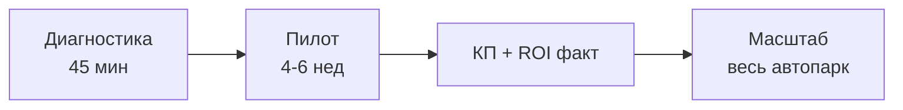

# FleetPilot — Sales Playbook (РФ)

**Версия:** 1.0 · **Дата:** 23.06.2026  
**Схема:** Диагностика → Пилот → Масштабирование

---

## 1. ICP (Россия)

| Сегмент | Размер | Боль | Оффер |
|---------|--------|------|-------|
| **FTL/LTL перевозчики** | 20–50 ТС | Топливо 35%, диспетчеризация | Pro · Founding ₽49K |
| **Негабарит / спецтехника** | 10–40 ТС | Спецразрешения, ПОДД, штрафы | Pro + **Permit Agent** |
| **Корпоративный транспорт** | 15–30 ТС | Развозка, контроль, отчётность | Starter / Pro |
| **Диспетчерские** | 30+ ТС | Excel, хаос заявок | Dispatch + Route |

**ЛПР:** коммерческий директор, руководитель автопарка, главный диспетчер.  
**North Star:** ₽ экономии / месяц (подтверждённая в ROI dashboard).

---

## 2. Воронка продаж

```
Привлечение → Квалификация → Диагностика → Демо → Пилот → КП → Сделка → Onboarding
```

| Этап | Цель | Артефакт | KPI |
|------|------|----------|-----|
| 1. Привлечение | Интерес | fleetpilot.ru, ROI-форма, контент | MQL |
| 2. Квалификация | Fit | Анкета BANT | SQL |
| 3. Диагностика | Боли, scope | Протокол встречи | Discovery done |
| 4. Демо | 2–3 сценария | Wireframes / demo org | Demo held |
| 5. Пилот | Доказать ROI | 4–6 нед, 10–30 ТС | KPI пилота |
| 6. КП | Закрыть | Модульное КП | Proposal sent |
| 7. Сделка | Контракт | Договор + onboarding | Won |
| 8. Success | Retention | QBR, expansion | NRR |

---

## 3. Квалификация (BANT + логистика)

**Обязательные вопросы:**

1. Сколько ТС? (мин. 15 для Starter)
2. Есть GPS с API? (Omnicomm / СтавТРЭК)
3. Негабарит? Росдормониторинг?
4. Кто ЛПР? Бюджет IT до ₽500K/год?
5. Срок решения? (90 дней = hot)

**Disqualify:** &lt;10 ТС, нет GPS, нет ЛПР, «просто посмотреть».

---

## 4. Офферы

| Оффер | Для кого | Содержание |
|-------|----------|------------|
| **Бесплатный расчёт ROI** | Inbound с лендинга | 24 ч, персональный PDF |
| **Диагностика 45 мин** | SQL | Карта процессов, scope пилота |
| **Founding Pilot** | Первые 10 клиентов | ₽49K×6 мес, onboarding free |
| **Permit Pilot** | Негабарит | Permit Agent + 5 маршрутов |

---

## 5. Скрипт первого звонка (2 мин)

> «Добрый день, [Имя]. Меня зовут [Имя], FleetPilot. Мы помогаем транспортным компаниям с 20–50 машинами снижать расходы на топливо и ускорять диспетчеризацию — подключаемся к Omnicomm и TMS, которые у вас уже стоят.  
> Подскажите, сколько у вас единиц техники и какую GPS-систему используете?  
> …  
> Предлагаю короткую диагностику 30–40 минут: разберём процессы и покажем, есть ли смысл пилота. Удобно [дата]?»

**Негабарит-ветка:**

> «Вижу, что вы возите негабарит. Мы как раз автоматизируем анализ маршрутов в Росдормониторинге — сокращаем время на спецразрешения. Это актуально?»

---

## 6. Схема «Диагностика → Пилот → Масштабирование» (рекомендуемая)



**Пилот KPI (примеры):**

- Fuel: −10% расход или 1+ алерт слива подтверждён
- Dispatch: время заявки 2.8 ч → &lt;1 ч
- Permit: −50% время подготовки маршрута Росдормониторинг

---

## 7. CRM-стадии

| Стадия | Вероятность |
|--------|-------------|
| New lead | 5% |
| Qualified | 15% |
| Discovery done | 25% |
| Demo done | 35% |
| Pilot active | 60% |
| Proposal | 75% |
| Negotiation | 85% |
| Won / Lost | 100% |

---

## 8. Шаблон КП (структура)

1. Резюме боли клиента (из протокола)
2. Решение FleetPilot (агенты + интеграции)
3. Scope пилота / этапы внедрения
4. KPI и метрики успеха
5. Тариф (Starter / Pro / Business)
6. Founding offer (если применимо)
7. Сроки, команда, SLA
8. Следующий шаг

---

## 9. Связанные документы

- [`FIRST-MEETING-GUIDE.md`](FIRST-MEETING-GUIDE.md)
- [`meeting-protocol-template.md`](meeting-protocol-template.md)
- [`ROSDORMONITORING-INTEGRATION.md`](ROSDORMONITORING-INTEGRATION.md)
- [`PRD.md`](PRD.md)

---

*FleetPilot · Sales Playbook RU · v1.0*
