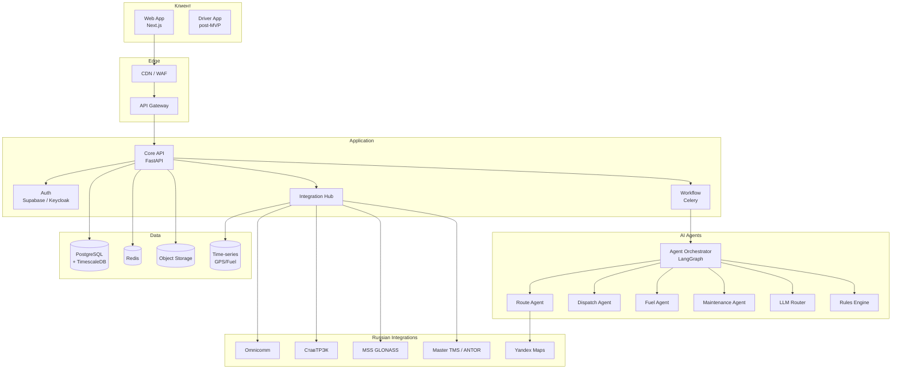
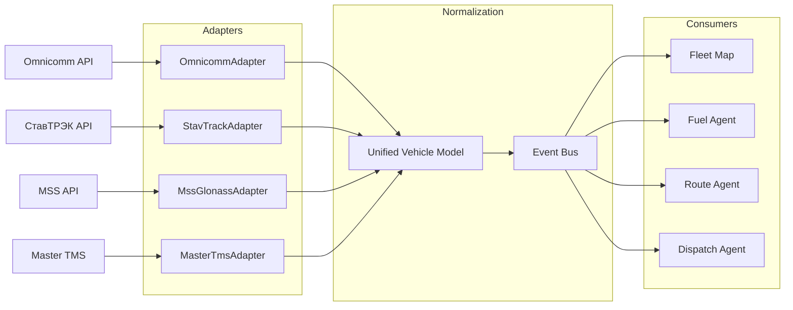
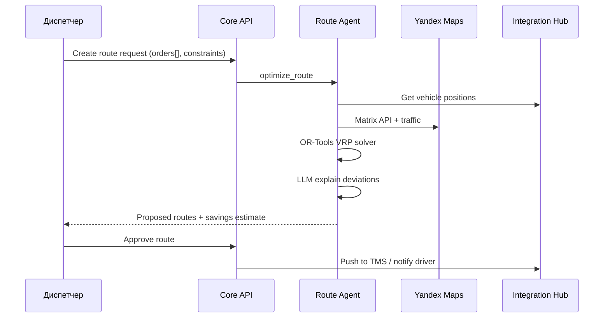
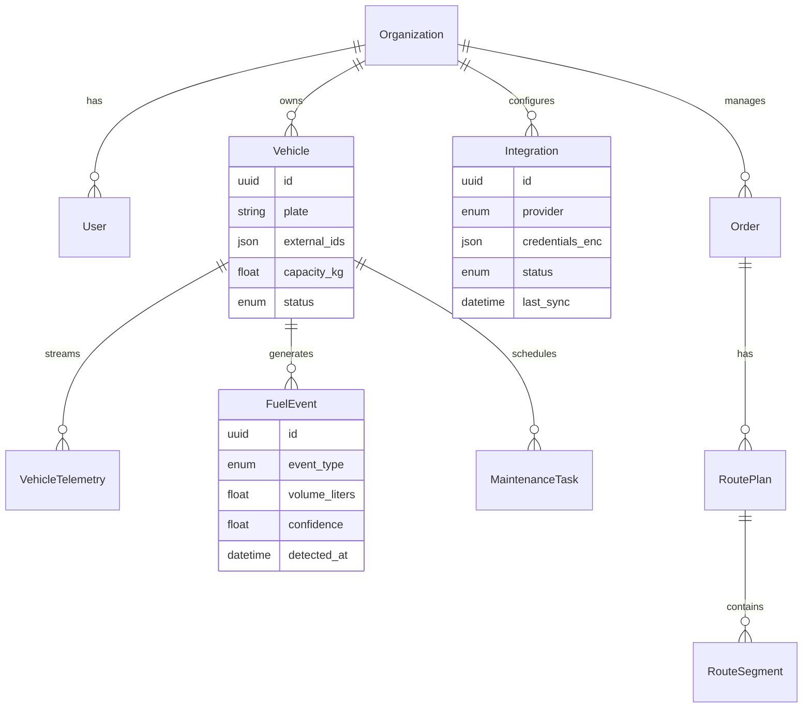

# Архитектура FleetPilot

**Версия:** 1.0 · **Дата:** 21.06.2026

---

## 1. Обзор

FleetPilot — multi-tenant B2B SaaS с **Integration Hub** (коннекторы к российским TMS/GPS) и **Agent Orchestrator** (4 ИИ-агента). Архитектура наследует паттерны TenderPilot: human-in-the-loop, audit trail, данные в РФ.

---

## 2. High-level architecture



---

## 3. Integration Hub (ключевой модуль)



**Unified Vehicle Model:**

```python
class VehicleState:
    vehicle_id: str          # FleetPilot internal
    external_ids: dict       # {"omnicomm": "123", "stavtrack": "456"}
    plate: str               # А123БВ777
    lat: float
    lon: float
    speed: float
    fuel_level: float | None
    fuel_rate: float | None
    driver_id: str | None
    status: enum             # moving | idle | offline
    last_update: datetime
```

**Adapter pattern:** каждый коннектор — отдельный Python-модуль с retry, rate limiting, health check.

---

## 4. Agent pipelines

### 4.1 Route Agent



### 4.2 Dispatch Agent

```
Input: заявка (email/Excel/API)
  → Parse & extract (LLM structured)
  → Classify (FTL/LTL, urgency, cargo type)
  → Match vehicles (availability, capacity, location)
  → Score assignments (distance, driver hours, client SLA)
  → Output: top-3 proposals with reasoning
  → Human approval → TMS create order
```

### 4.3 Fuel Agent

```
Input: fuel_level stream (ДУТ), GPS, CAN
  → Baseline model per vehicle (expected consumption)
  → Anomaly detection (sudden drop, off-route refuel)
  → Driver scoring (harsh braking, idle time)
  → Alert if confidence >= 0.85
  → Monthly savings report
```

### 4.4 Maintenance Agent

```
Input: odometer, engine hours, CAN DTC codes, history
  → Rules: interval-based (oil, tires, inspection)
  → ML: trend on vibration/temp (if available)
  → Output: maintenance schedule + 7-day forecast
```

---

## 5. Data model (core)



---

## 6. API surface (MVP)

```
# Integrations
POST   /api/v1/integrations              # Add connector
GET    /api/v1/integrations              # List connectors
POST   /api/v1/integrations/{id}/sync    # Force sync
GET    /api/v1/integrations/{id}/health  # Health check

# Fleet
GET    /api/v1/vehicles                  # List vehicles
GET    /api/v1/vehicles/{id}             # Vehicle detail
GET    /api/v1/vehicles/{id}/telemetry   # GPS + fuel history
GET    /api/v1/fleet/map                 # Real-time map data (SSE)

# Agents
POST   /api/v1/agents/route/optimize     # Route Agent
POST   /api/v1/agents/dispatch/process   # Dispatch Agent
GET    /api/v1/agents/fuel/alerts        # Fuel alerts
GET    /api/v1/agents/fuel/report        # Monthly report
GET    /api/v1/agents/maintenance/schedule

# Orders & Routes
POST   /api/v1/orders                    # Create/import order
GET    /api/v1/orders                    # List orders
POST   /api/v1/routes/{id}/approve       # Human approval

# Analytics
GET    /api/v1/analytics/roi             # ROI dashboard
GET    /api/v1/analytics/savings         # Savings breakdown

# Billing
POST   /api/v1/billing/checkout
GET    /api/v1/billing/usage
```

---

## 7. Tech stack

| Layer | Technology |
|-------|------------|
| Frontend | Next.js 15, TypeScript, Tailwind, shadcn/ui, MapLibre |
| API | FastAPI, Pydantic v2 |
| Workers | Celery + Redis |
| DB | PostgreSQL 16 + TimescaleDB (telemetry) |
| Cache | Redis |
| Storage | Yandex S3 |
| Auth | Supabase Auth |
| LLM | Claude Sonnet (dispatch, explanations) |
| Optimization | OR-Tools (VRP) |
| Maps | Yandex Maps API, 2GIS fallback |
| Observability | Langfuse, Sentry, Grafana |

---

## 8. Security

- Credentials коннекторов: AES-256 encrypted at rest
- Tenant isolation: RLS по `organization_id`
- Audit log: все agent decisions + human approvals
- 152-ФЗ: Yandex Cloud ru-central1

---

## 9. Deployment (MVP lean)

**VPS 8 vCPU / 32GB RAM, Docker Compose** — до 10 клиентов, 500 ТС aggregate.

Scale path: K8s на Yandex Cloud при 50+ клиентах.

---

*Архитектура адаптирована из TenderPilot (startupp) с заменой document pipeline на Integration Hub + fleet agents.*
