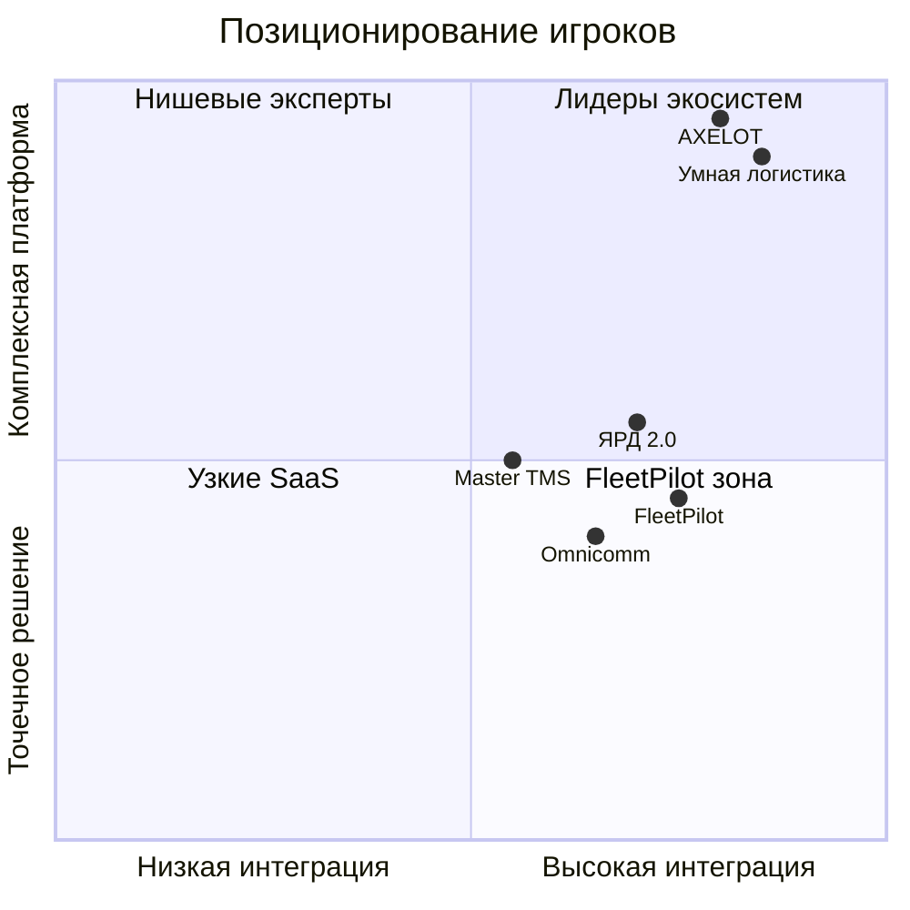

# Анализ российских технологических решений — транспорт и логистика

**Дата:** 21 июня 2026  
**Цель:** определить позиционирование FleetPilot на рынке РФ

---

## 1. Карта рынка

---

## 2. Комплексные платформы

### 2.1 «Умная логистика»

| Параметр | Оценка |
|----------|--------|
| Охват | 40 000+ компаний |
| Эффект | до 26% экономии бюджета на логистику |
| Сильные стороны | ERP-интеграции, масштаб, узнаваемость |
| Слабые стороны | Мало AI-native workflow; «чёрный ящик» для SMB |
| **Gap для FleetPilot** | ИИ-агенты поверх их API; быстрые wins для парка 20–50 ТС без полной миграции |

### 2.2 AXELOT (WMS / TMS / SCM)

| Параметр | Оценка |
|----------|--------|
| Охват | 1000+ проектов, импортозамещение SAP / Manhattan |
| Сильные стороны | Полный стек, 24/7 поддержка, enterprise-grade |
| Слабые стороны | Длительное внедрение (6–18 мес.), высокий CAPEX |
| **Gap для FleetPilot** | AI-слой для mid-market без замены WMS/TMS; пилот за 90 дней |

### 2.3 ЯРД 2.0 (YMS)

| Параметр | Оценка |
|----------|--------|
| Охват | Дворовая логистика, патент WIPO |
| Сильные стороны | RFID, штрих-коды, замена SAP YMS / Generix |
| Слабые стороны | Узкая специализация (двор), не покрывает маршруты/диспетчеризацию |
| **Gap для FleetPilot** | Интеграция YMS → Dispatch Agent для сквозного планирования |

---

## 3. Специализированные решения

### 3.1 GPS/ГЛОНАСС мониторинг

| Вендор | Сильные стороны | Интеграция FleetPilot |
|--------|-----------------|----------------------|
| **СтавТРЭК** | Региональное покрытие, цена | REST API → Route Agent |
| **MSS GLONASS** | Гос. совместимость, Era-Glonass | Телематика → Fuel Agent |
| **Omnicomm** | Лидер топливного контроля + GPS | **Приоритетный коннектор P0** |

**Критическое требование пользователя:** интеграция с **уже установленными** системами мониторинга на ТС — не замена оборудования, а агрегация данных.

### 3.2 TMS

| Вендор | Фокус | Роль в экосистеме |
|--------|-------|-------------------|
| Master TMS | Планирование перевозок | Источник заявок для Dispatch Agent |
| ANTOR LogistInWeb | Веб-TMS для SMB | Bidirectional sync маршрутов |
| Schedex | Расписания, FTL/LTL | Route Agent optimization output |

### 3.3 Контроль топлива

- **Omnicomm** — лидер рынка ДУТ, CAN-шина, стиль вождения
- **Era-Glonass** — обязательность для части сегментов

FleetPilot **не ставит ДУТ** — анализирует данные существующих датчиков через Fuel Agent.

### 3.4 WMS

- **FIRST**, **Axelot WMS**, **CloudShop** — складские операции
- FleetPilot Этап 3: коннектор WMS ↔ TMS для консолидации грузов

---

## 4. Сравнительная матрица

| Критерий | Умная логистика | AXELOT | Omnicomm | Master TMS | **FleetPilot** |
|----------|-----------------|--------|----------|------------|----------------|
| AI-агенты | ○ | ○ | ○ | ○ | **●●●** |
| Интеграция чужих систем | ●● | ●●● | ● (своё) | ●● | **●●●** |
| Time-to-value | 6–12 мес. | 6–18 мес. | 1–3 мес. | 3–6 мес. | **1–3 мес.** |
| ICP 20–50 ТС | ● | ○ | ●●● | ●● | **●●●** |
| Стоимость входа | ₽₽₽ | ₽₽₽₽ | ₽₽ | ₽₽ | **₽** (SaaS) |
| ROI доказуемость | ●● | ●● | ●●● (топливо) | ●● | **●●●** |

---

## 5. Стратегическое позиционирование FleetPilot

### 5.1 Что мы НЕ делаем

- Не продаём GPS-трекеры и ДУТ (партнёрство с Omnicomm / интегратором)
- Не заменяем AXELOT WMS на старте
- Не конкурируем с «Умной логистикой» как ERP

### 5.2 Что мы делаем

> **«Operating system для ИИ-автоматизации автопарка»** — агрегируем данные из установленных систем и запускаем автономных агентов с human-in-the-loop.

### 5.3 Поэтапное внедрение (из экономического анализа)

| Этап | Срок | Бюджет | Фокус FleetPilot |
|------|------|--------|------------------|
| 1 | 3 мес. | ₽630K | GPS + Fuel Agent, коннекторы Omnicomm/СтавТРЭК |
| 2 | +6 мес. | +₽940K | Dispatch Agent + ЭТрН + TMS sync |
| 3 | +9 мес. | +₽980K | WMS коннектор + сквозная аналитика |

### 5.4 Барьеры и ответы

| Барьер | % компаний | Ответ FleetPilot |
|--------|------------|------------------|
| Высокие затраты | 78% | Поэтапный SaaS от ₽49K/мес, ROI за 7.8 мес. (Этап 1) |
| Устаревшая IT | 65% | Коннекторы без замены систем |
| Сопротивление персонала | 58% | Агенты упрощают работу диспетчера, не заменяют |

---

## 6. Конкурентное преимущество (moat)

1. **Integration hub** — единый слой над 10+ российскими вендорами
2. **Agent orchestration** — LangGraph pipeline с audit trail (паттерн из TenderPilot)
3. **ROI dashboard** — доказуемая экономия по каждому агенту
4. **152-ФЗ** — данные в РФ, on-prem опция для enterprise

---

*Следующий шаг: 15 discovery-интервью с диспетчерами и логистами компаний 20–50 ТС.*
